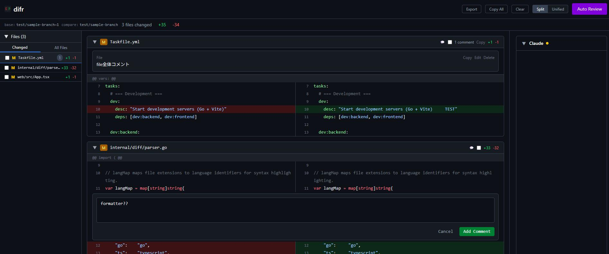

# difr

- プラットフォームに依存しない、ローカルで動作するコードレビュー支援ツール
- Git の差分をブラウザ上で GitHub 風に可視化
- コメント機能と Claude Code 連携（Chat + 自動レビュー）を提供



## 特徴

- GitHub 風 Diff Viewer
  - Split / Unified 表示切替
  - 構文ハイライト
- コメント
  - ファイル単位・行単位でコメントを追加・編集・削除
  - Markdown / JSON エクスポート
- Claude Code 連携
  - WebSocket 経由のリアルタイムチャット
  - 自動コードレビュー
- 単一バイナリ配布
  - Go embed でフロントエンドを内蔵、インストール不要

## インストール

```bash
go install github.com/shimasan0x00/difr/cmd/difr@latest
```

### ソースからビルド

前提: Go 1.25+, Node.js 20+, [Task](https://taskfile.dev/)

```bash
git clone https://github.com/shimasan0x00/difr.git
cd difr
task install
task build
# ./difr が生成されます
```

## 使い方

- とりあえず動かしてみる

```bash
difr main feature/xxx
```

- 詳細

```bash
difr                        # 最新コミットの diff (HEAD~1..HEAD)
difr <commit>               # 特定コミットの diff
difr <base> <compare>       # 2コミット間の diff
difr staged                 # ステージング済み変更
difr working                # 未ステージング変更
git diff | difr             # stdin パイプ入力
```

### オプション

| フラグ | デフォルト | 説明 |
|--------|-----------|------|
| `--port, -p` | `3333` | サーバーポート |
| `--host` | `127.0.0.1` | バインドアドレス |
| `--mode, -m` | `split` | 表示モード (`split` / `unified`) |
| `--no-open` | `false` | ブラウザ自動起動を抑制 |
| `--no-claude` | `false` | Claude Code 連携を無効化 |
| `--watch, -w` | `false` | ファイル変更監視 (experimental) |

## 技術スタック

| 領域 | 技術 |
|------|------|
| バックエンド | Go 1.25 / Chi v5 / cobra |
| フロントエンド | React 19 / TypeScript 5.9 / Vite 7 |
| スタイリング | Tailwind CSS v4 |
| 状態管理 | Zustand v5 |
| 構文ハイライト | Shiki (github-dark テーマ) |
| WebSocket | coder/websocket |
| テスト | testify / Vitest / React Testing Library |

## 開発

```bash
# 開発サーバー起動 (Go :3333 + Vite :5173)
task dev

# テスト
task test              # 全テスト (Go + Frontend)
task test:backend      # Go テストのみ (-race 有効)
task test:frontend     # Vitest のみ

# リント
task lint

# ビルド成果物削除
task clean
```

## ライセンス

[MIT](LICENSE)
